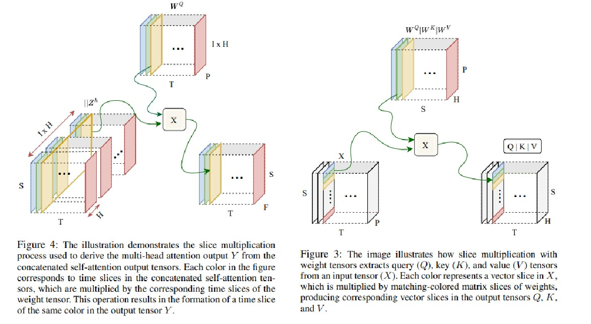
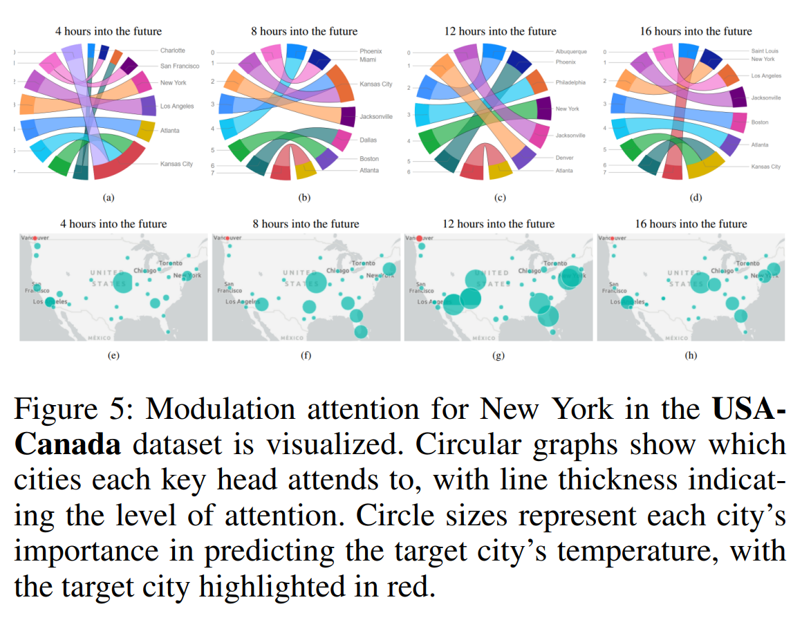
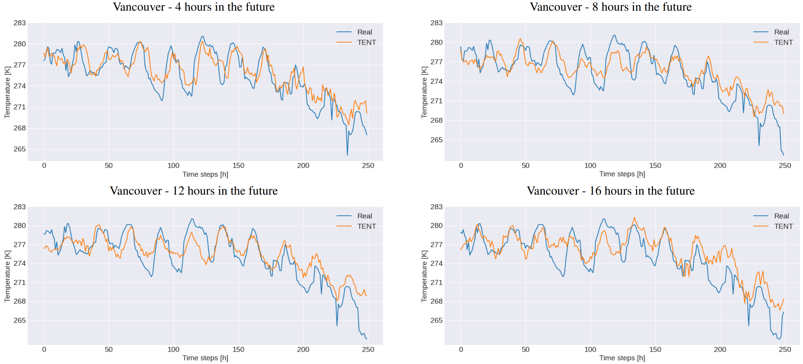
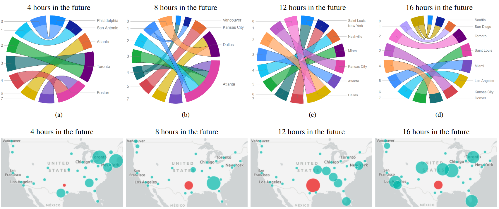

## FATE
Official implementation code of the paper: "FATE: Focal-modulated Attention Encoder for temperature prediction" [(ArXiv link)]().

## Model architecture


(a) Model architectureTensorial. (b) Tensorial Focal-Modulation. (c) Tensorial multi-head modulation.

## Results


The obtained test MAE of the models for USA-Canada dataset averaged over cities (a) and prediction time steps (b).


The comparison between the predictions of FATE model and the real measurements for hourly temperature of the test set of Vancouver.

## Focal Modulation visualization


Modulation visualization for Dallas in USA-Canada dataset.

## Data

In order to download the data, please email to the following address:

t-tashraf@microsoft.com


## Usage
Execute the notebook on colab (Use TPU for FATE): [TT_All_models_experiments.ipynb](notebooks/TT_All_models_experiments.ipynb)

## Citation
If you use our data and code, please cite the paper using the following bibtex reference:
```

```

