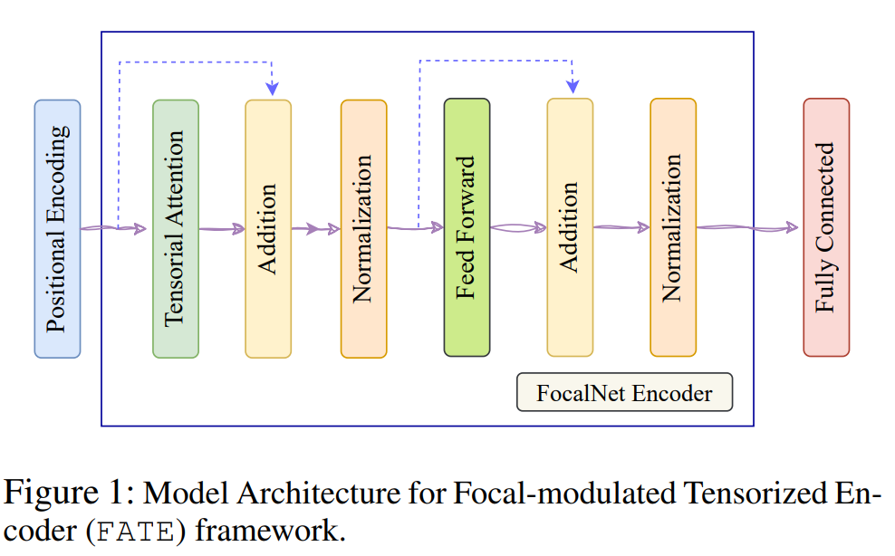
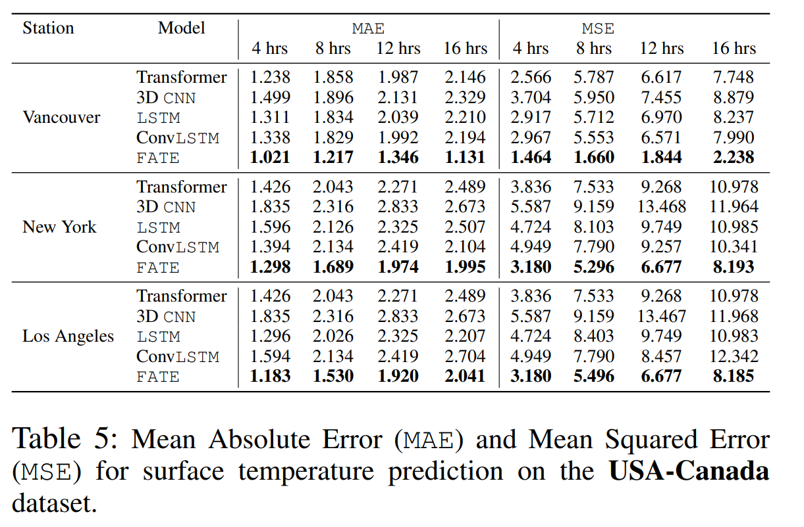

<div align="center">

<!-- TITLE -->
# **FATE: Focal-modulated Attention Encoder for temperature prediction**

[](https://arxiv.org/abs/2303.16203)
[](http://diffusion-classifier.github.io)
</div>

This is the official implementation of the arxiv paper [FATE: Focal-modulated Attention Encoder for temperature prediction](https://arxiv.org/abs/2303.16203) by Tajamul Ashraf and Janibul Bashir.
<!-- DESCRIPTION -->
## Abstract

One of the biggest issues facing humanity in the twenty-first century is climate change, as shown by the increasing sealevels, melting glaciers, and frequent storms. Accurate temperature forecasting is crucial for understanding and mitigat-ing its impacts. Cutting-edge data-driven models for temper-ature forecasting typically employ recurrent neural networks(CNNs), with certain models integrating attention mechanisms. However RNNs sequential processing limits paral-lelization, especially for longer sequences. In order to do this,we provide a brand-new method for temperature predictionthat is based on the FocalNet Transformer architecture. Byfunctioning in a multi-tensor format, the suggested Focal-modulation Attention Encoder (FATE) framework leveragesthe spatial and temporal nuances of meteorological data char-acteristics by integrating tensorized modulation. Compara-tive assessments against existing transformer encoder archi-tectures, 3D CNNs, LSTM, and ConvLSTM demonstrate our model’s superior ability to capture nuanced patterns inher-ent in the data, particularly in the context of temperature prediction. We also introduce a new labeled dataset, Cli- mate change Parameter dataset (CCPD), which encompasses 40 years of data from J&K region on seven key parameters that influence climate change, supporting further research in this area. Experiments on two real-world benchmark temper- ature datasets from weather stations in the USA, Canada, and Europe demonstrate accuracy improvements of 12%, 23%,and 28% respectively, compared to existing SOTA models. In addition, we achieved state-of-the-art results on our CCPD dataset with a 24% improvement. To understand FATE, we introduce two modulation scores from the tensorial modu- lation process. These scores clarify our model’s decision- making and key climate change parameters. For reproducible research, we will release the source code, pre-trained FATE model, and CCPD dataset.


## Model architecture



## Results


The obtained test MAE of the models for USA-Canada dataset averaged over cities (a) and prediction time steps (b).

## Focal Modulation visualization


Modulation visualization for Dallas in USA-Canada dataset.

## Data

In order to download the data, please email to the following address:

t-tashraf@microsoft.com


## Usage
Execute the notebook on colab (Use TPU for FATE): [Experiments_club.ipynb](notebooks/Experiments_club.ipynb)

## Citation
If you use our data and code, please cite the paper using the following bibtex reference:
```

```
Thank you for your attention. Cheers!
